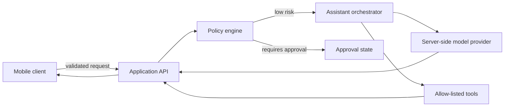

# System Architecture

## Overview

## Architectural rules

The mobile client never contains an LLM provider key or a third-party connector secret. The API validates user input, creates a task state, applies the policy engine before model or tool work, and returns a result plus audit summary. A future connector adapter must declare input/output schemas, scopes, timeout, risk and a user-facing confirmation summary.

| Component | Responsibility | Security boundary |
|---|---|---|
| Client | UI, local history, user consent, request composition | No secrets; no direct privileged service calls |
| API | Validates requests and invokes provider | Server-side credentials only |
| Policy engine | Classifies risk and requires approval | Cannot be overridden by model output |
| Orchestrator | Chooses a safe provider and constructs response | No arbitrary tool execution |
| Connector adapter | Narrow, declared external operation | OAuth/API scope and per-action consent |
| Audit log | Task state and human-readable events | Excludes secret values and raw credentials |

This design follows least privilege and explicit authorization principles recommended for AI agent tools. [1] [2]

## References

[1] [OWASP AI Agent Security Cheat Sheet](https://cheatsheetseries.owasp.org/cheatsheets/AI_Agent_Security_Cheat_Sheet.html)

[2] [Google ADK Safety and Security](https://adk.dev/safety/)
